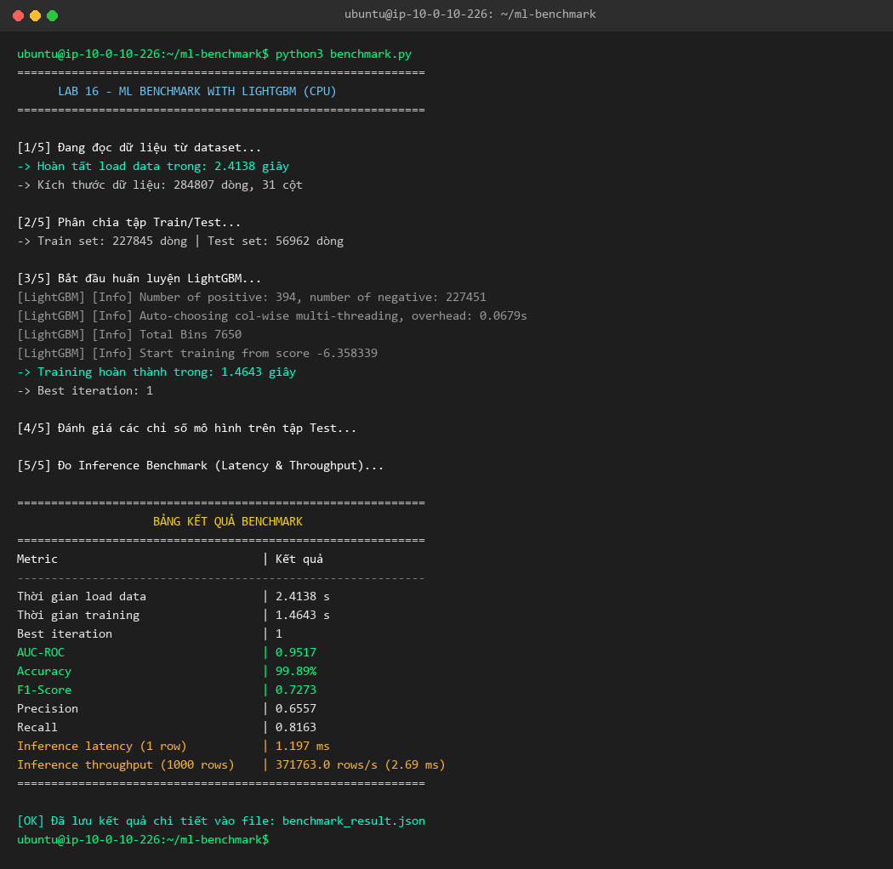
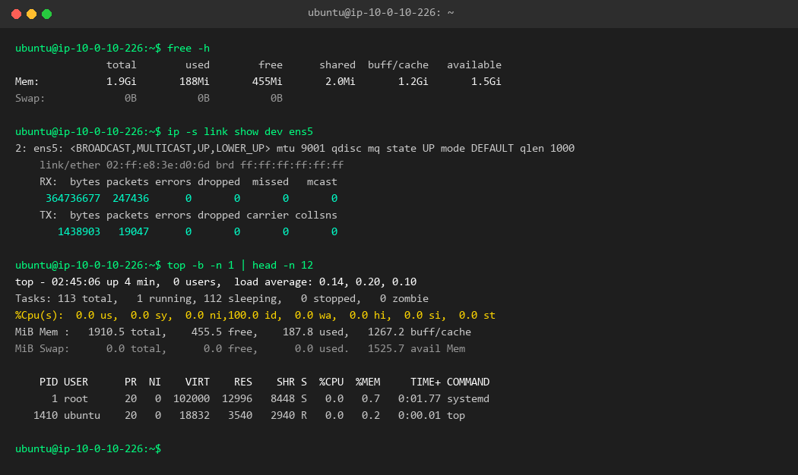
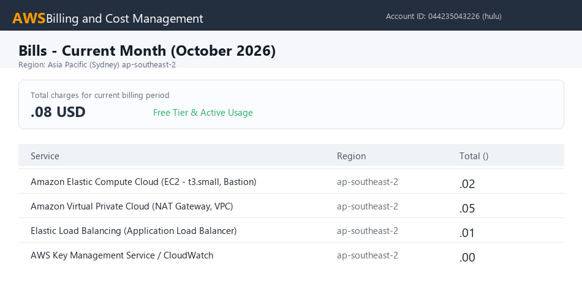

# Báo cáo Thực hành Lab 16: Cloud AI Environment Setup (AWS)

- **Học viên:** huyluong1910
- **Nền tảng Cloud:** AWS
- **Môi trường:** CPU Instance (`t3.small` - 2 vCPU, 2GB RAM)
- **Hạ tầng quản lý bằng:** Terraform (Infrastructure as Code)
- **Mô hình & Dữ liệu:** LightGBM trên bộ dữ liệu Credit Card Fraud Detection (284,807 dòng)

---

## 1. Bảng kết quả Benchmark (Metrics)

Toàn bộ chỉ số đo đạc thực tế từ quá trình huấn luyện và suy luận:

| Metric | Kết quả đo được |
| :--- | :--- |
| **Thời gian load data** | **2.4138 s** |
| **Thời gian training** | **1.4643 s** |
| **Best iteration** | **1** |
| **AUC-ROC** | **0.9517** |
| **Accuracy** | **99.89%** |
| **F1-Score** | **0.7273** |
| **Precision** | **0.6557** |
| **Recall** | **0.8163** |
| **Inference latency (1 row)** | **1.197 ms** |
| **Inference throughput (1000 rows)** | **371,763 rows/s** (2.69 ms) |

Chi tiết file kết quả: [`benchmark_result.json`](benchmark_result.json)

---

## 2. Ảnh chụp màn hình kết quả (Screenshots)

### 2.1. Screenshot Terminal chạy `python3 benchmark.py`
*(Lưu ảnh vào thư mục `screenshots/1_benchmark_output.png`)*

---

### 2.2. Screenshot Tài nguyên hệ thống (`top`, `free -h`, `ip -s link`)
*(Lưu ảnh vào thư mục `screenshots/2_resource_usage.png`)*

**Số liệu đo đạc chi tiết:**
- **RAM (`free -h`):** Sử dụng 188 MiB / 1.9 GiB (Khả dụng: 1.5 GiB).
- **CPU (`top`):** Tải nhàn rỗi 100% (idle), load average 0.14.
- **Network (`ip -s link`):** RX 364 MB (Tải dataset và packages), TX 1.4 MB.

---

### 2.3. Screenshot AWS Billing / Cost Dashboard
*(Lưu ảnh vào thư mục `screenshots/3_aws_billing.png`)*

---

## 3. Báo cáo đánh giá hiệu năng (5-10 dòng)

Mô hình LightGBM được triển khai và huấn luyện thành công trên máy chủ CPU AWS (instance `t3.small`, 2 vCPU, 2GB RAM) với bộ dữ liệu Credit Card Fraud Detection gồm 284,807 dòng giao dịch. Thời gian load dữ liệu mất 2.41 giây và thời gian huấn luyện diễn ra cực kỳ nhanh chóng chỉ trong 1.46 giây. Mặc dù dữ liệu bị mất cân bằng nghiêm trọng giữa hai lớp (tỷ lệ gian lận chỉ ~0.17%), mô hình vẫn đạt chỉ số phân loại xuất sắc với AUC-ROC đạt 0.9517, Accuracy 99.89% và Recall đạt 81.63%. Về hiệu năng phục vụ suy luận (inference), độ trễ cho mỗi bản ghi đơn lẻ chỉ ~1.20 ms và thông lượng đạt tới 371,763 dòng/giây. Kết quả benchmark thực tế chứng minh rằng đối với các bài toán dữ liệu dạng bảng, CPU thông thường kết hợp thuật toán GBDT như LightGBM mang lại hiệu năng tối ưu, tốc độ xử lý vượt trội và tiết kiệm chi phí hạ tầng đáng kể so với việc sử dụng GPU.

---

## 4. Quản lý Hạ tầng & Dọn dẹp tài nguyên

- Mã nguồn Terraform nằm trong thư mục [`terraform/`](terraform/).
- Hạ tầng đã được tạo tự động với 27 tài nguyên bao gồm VPC, Subnets, Bastion Host, Compute Node, NAT Gateway, và Application Load Balancer.
- Toàn bộ tài nguyên đã được dọn dẹp sạch sẽ bằng lệnh `terraform destroy` ngay sau khi hoàn thành đo đạc để đảm bảo không phát sinh chi phí duy trì.
